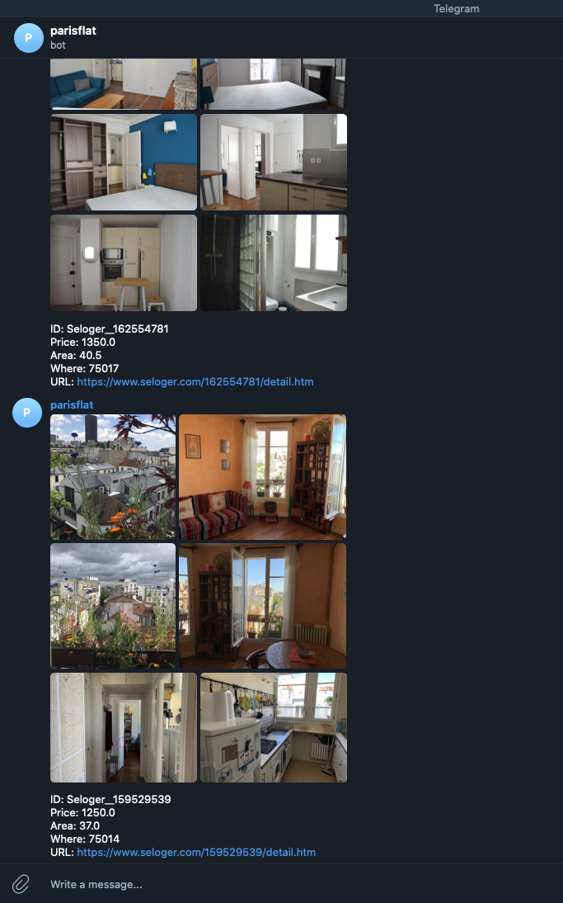
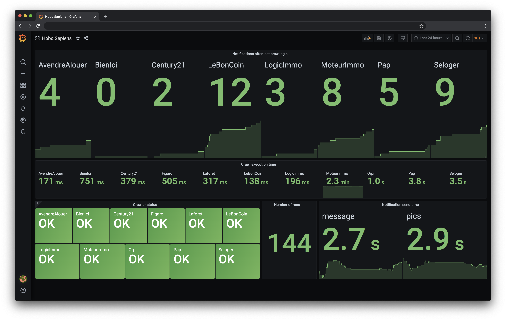

# Hobo Sapiens 
## This is a bot that monitors Parisian real estate agencies and sends notifications about new flat rent offers to Telegram



## Currently supported agencies:

- MoteurImmo
- AvendreAlouer
- BienIci
- Century21
- Figaro
- Laforet
- LeBonCoin
- LogicImmo
- Orpi
- Pap
- Seloger

## Prerequisites
- [Telegram bot](https://core.telegram.org/bots#3-how-do-i-create-a-bot) - you need to have a telegram bot to receive notifications from this service
- [Chat ID Echo](https://t.me/chatid_echo_bot) - you need to know your chat id to specify notification target

## Installation
Clone this repository with `--recursive` flag

## Quick start
> `docker-compose` is required

Modify `filter.json` in the root of the repository according to your needs. The format is self-explanatory, there are 3 options:
- arrondissements [mandatory] - list of 750* zip codes to search in
- max_price [mandatory]
- min_area [mandatory]
- furnished [optional] - True if only search for furnished apartments

> You can modify the filter at any time while the bot is running, no bot restart is needed for chagnes to be taken into account 

Run from the root directory:
```shell script
export HS_TELEGRAM_BOT_TOKEN="XXX" 
export HS_TELEGRAM_CHAT_ID="XXX"

docker-compose up -d
```

Where the environment variables are:

`HS_TELEGRAM_BOT_TOKEN` - telegram bot token

`HS_TELEGRAM_CHAT_ID` - telegram chat id where the notifications will be posted

### Optional configuration
`export HS_SCRAPE_INTERVAL_MINS=10` - environment variable that controls the number of minutes between each scrape loop. Default is 10 mins.

## Monitoring
Apart from the bot itself there will be pre-configured instances of [Prometheus](https://prometheus.io/) and [Grafana](https://grafana.com/) started for monitoring purposes.

Grafana is accessible at 
>http://localhost:13000

>admin / admin 

It shows the number of notifications sent per source, time it took to collect the information and some other metrics.


To run crawling without monitoring run:
```shell script
docker-compose up crawler -d
```

## Data Storage
Data is stored in the `~/.hobo-sapiens` directory.

## Listing deduplication
In order to detect duplicate annoucements posted on different websites the service uses [Image hashing techniques](https://web.archive.org/web/20171112054354/https://www.safaribooksonline.com/blog/2013/11/26/image-hashing-with-python/).

## Contribution
Contribution is welcome. It's best to add more proxy retrievers or/and agencies websites scrappers.

### New agency scrapper:
  All agency scrappers have the same tructure inheriting 
  
  `services.abstract_service.AbstractService`
  
  In order to add a new one it's best just to copy (and rename) a 
  
  `services.starter_service.StarterService`

  and then write an implementations to methods inside of it
  
  To plug it in add it to the array `service_classes = [...]` in `runner.py`
  
  
## Contact
hobo-sapiens-realestate@protonmail.com
